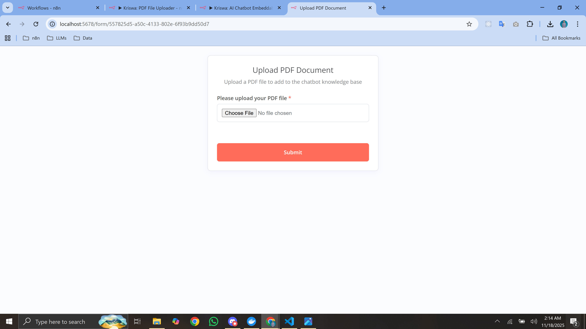
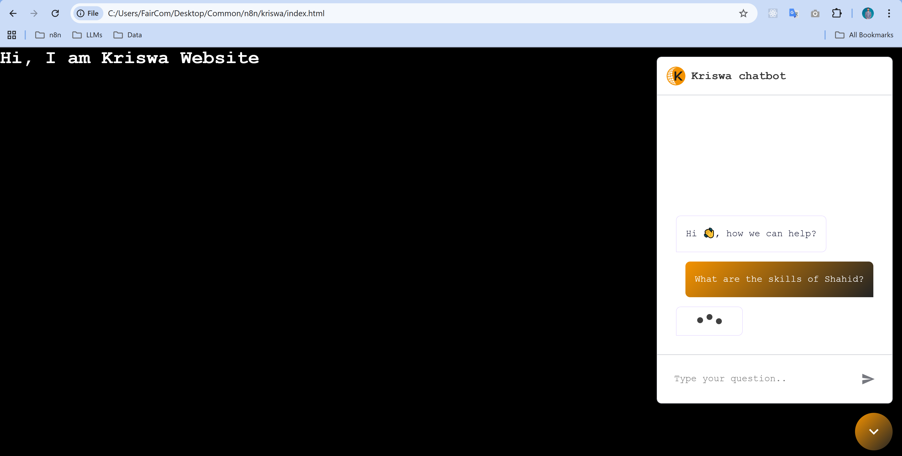

# 📘 AI Chatbot – n8n + Qdrant + Google Gemini (RAG System)

A fully functional **AI-powered PDF Chatbot** built using **n8n**, **Qdrant Vector Database**, **Google Gemini**, and **LangChain**. The system lets users upload PDFs, automatically processes them into embeddings, and allows a chatbot to answer questions using Retrieval-Augmented Generation (RAG).

This repository contains **two n8n workflows** that together create a complete knowledge-based AI chat system.


## 📺 Video Demo

[Watch the video on YouTube](https://youtu.be/BBSIhecODTQ)

### Build Your Knowledge Base

First, upload all your PDF files to create your knowledge base. This form handles PDF ingestion, text extraction, chunking, and embedding into Qdrant.


*Example: Upload PDFs and process them into the chatbot knowledge base.*

### Chatbot UI (Fully Customizable)

Once your knowledge base is ready, interact with your AI chatbot via the test frontend.


*Example: Chatbot responding to user queries using the uploaded PDFs.*

---

# 🚀 Features

* 📤 **Upload PDFs** via public form
* 🔍 Automatic **text extraction + chunking**
* 🧠 **Embeddings** generated using Google Gemini
* 🗄️ **Vector storage** in Qdrant (`chatbot_docs` collection)
* 💬 **Chatbot with RAG** retrieves relevant document chunks
* 🧵 **Streaming responses** via webhook
* 🧩 Short-term **memory buffer** for more natural conversations

---

# 🏗️ Architecture Overview

```
PDF Upload → Text Loader → Text Splitter → Gemini Embeddings → Qdrant Vector Store

User Query → Chat Trigger → AI Agent → (LLM + Memory + Qdrant Retrieval) → Streaming Response
```

---

# 📂 Workflows Included

## 1️⃣ Workflow 1 – PDF Upload & Vectorization

**Purpose:** Ingest documents into the chatbot knowledge base.

### What it does:

* Accepts PDF file upload
* Extracts all text
* Splits text into chunks (200-character overlap)
* Generates embeddings (Google Gemini)
* Stores vectors into **Qdrant** (`chatbot_docs`)

### Key Nodes:

* `Form Trigger`
* `Default Data Loader (PDF Loader)`
* `Recursive Character Text Splitter`
* `Google Gemini Embeddings`
* `Qdrant Vector Store (Insert)`

---

## 2️⃣ Workflow 2 – AI Chatbot (RAG + Streaming)

**Purpose:** Provide intelligent chat responses using stored PDFs.

### What it does:

* Listens to user messages via public webhook
* Retrieves context from Qdrant
* Uses Gemini Chat Model to answer
* Streams the response back
* Maintains a conversation memory buffer

### Key Nodes:

* `Chat Trigger`
* `AI Agent`
* `Google Gemini Chat Model`
* `Memory Buffer Window`
* `Qdrant Vector Store (Tool Mode)`

---

# 🛠️ Requirements

* **n8n** 1.50+
* **Qdrant Cloud** or local Qdrant instance
* **Google Gemini API Key** (Gemini 1.5 / PaLM API)
* LangChain nodes enabled in n8n

---

# 🔧 Setup Instructions

## 1. Clone/Import Workflows

Import both JSON workflow files inside the repository into your n8n instance.

## 2. Configure Credentials

You must add credentials in n8n:

* **Qdrant API Key**
* **Google Palm/Gemini API Key**

Ensure both workflows use the same Qdrant collection name:

```
chatbot_docs
```

## 3. Enable Webhook URLs

* Workflow 1 generates a **public form URL** → PDF uploader
* Workflow 2 exposes a **chat webhook URL** → for frontend chat UI

## 4. Test the Pipeline

### Test Workflow 1

1. Open the form link.
2. Upload any PDF.
3. Check Qdrant → verify vectors added.

### Test Workflow 2

1. Send a POST request to the webhook:

```json
{ "message": "Summarize the uploaded document" }
```

2. Receive streaming response.
3. Verify chatbot uses PDF context.

---

---

# 🗄️ Qdrant Collection Structure

Collection Name: **chatbot_docs**

Each stored vector contains:

* Chunked text
* Embedding
* Metadata
* Source information

---

# 🧪 Example Use Cases

* Customer support knowledge base
* Internal documentation chatbot
* Product manual assistant
* Research paper question-answering
* Legal or financial document analysis

---

# 🤖 Tech Stack

* **n8n** (automation + workflow engine)
* **LangChain** (AI pipeline orchestration)
* **Google Gemini** (LLM + Embeddings)
* **Qdrant** (vector database)
* **JavaScript/TypeScript** (n8n custom logic)

---

# 📌 Future Enhancements

* 🔒 User authentication for uploads

---

# ❤️ Author / Maintainer

This project is built and maintained by **Syed Shahid Ali** — Full Stack Developer & n8n Automation Specialist.

For collaboration opportunities or automation projects:
<!-- 📧 Email: *add your email here* -->
💼 LinkedIn: *https://www.linkedin.com/in/syed-shahid-ali-ssa*

---

# ⭐ Support

If you found this project useful:

* Give it a **star** ⭐ on GitHub!
* Fork it and create your own document-aware chatbot.

---

# 📄 License

MIT License – free to use, modify, and distribute.
